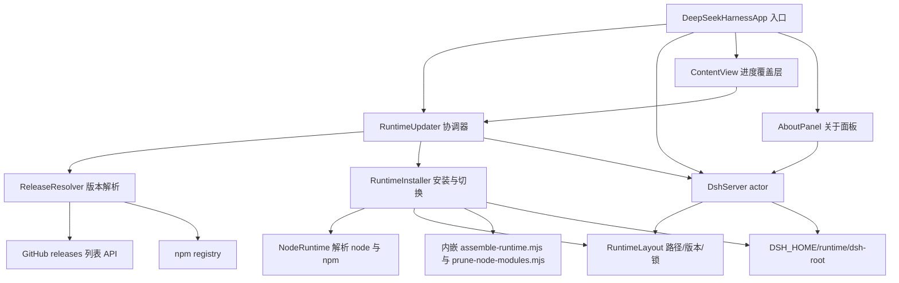

# native-macos 运行时自动更新（含「关于」面板版本同步）

## 产品概述

为 `native-macos` 的 DeepSeek Harness macOS 桌面应用增加「运行时自动更新」能力：应用启动后在后台静默检查 dsh 是否有新版本，发现新版本时弹出原生确认框；用户确认后，应用按与打包脚本 `build-release.sh` 相同的方式获取并安装最新的 `@deepseek-ai/dsh` 生产闭包，随后热替换运行时并重启内嵌服务，界面自动加载新版本运行时。全程无需重新打包、无需重新安装 `.app`。「关于」面板显示的版本号同步为当前生效的 dsh 运行时版本。

## 核心功能

- **启动后台静默检查**：不阻塞 dsh 启动与界面加载；网络或 registry 不可用只写日志，不打扰用户。
- **最新版本判定**：以 GitHub Release 为准（tag 形如 `dsh-v0.1.5-rc.1`），用 npm registry 校验该版本确已发布；未发布则回退到 npm 最新版本。
- **版本比较**：按语义化版本规则比较（含预发布版本排序），不做降级安装。
- **更新确认**：仅在确有新版本时弹出原生对话框，展示当前版本与目标版本；用户可取消。
- **增量下载**：复用 `<DSH_HOME>/runtime/.npm-cache` 作为 npm 内容寻址缓存，仅下载新增/变更的依赖 tarball；且只替换运行时目录本身，不重新下载或改写 `.app`。
- **安装与剪枝**：在用户目录暂存区安装闭包，剔除不可运行文件（类型声明、sourcemap、文档与测试目录），生成与打包产物一致的桥接目录结构。
- **热替换**：以目录 rename 原子切换运行时，随后只重启 dsh 子进程；应用进程不退出、不重启。
- **原子切换与回滚**：切换前保留上一版本；新运行时启动失败时自动回滚，上一版本仍可用。
- **阶段化进度反馈**：更新期间主界面显示校验、下载安装、优化、切换、重启等阶段进度，避免误以为卡死。
- **只读应用包**：可更新运行时位于用户可写目录，应用包内运行时仅作兜底与首次种子，不修改应用包、不影响代码签名与 Gatekeeper。
- **版本自愈**：当应用被替换为携带更新运行时的版本时，自动采用版本更高的那份运行时，避免旧运行时长期遮蔽新包。
- **「关于」面板版本号同步**：面板显示的版本取自当前生效的 dsh 运行时（而非编译期 `Info.plist`），更新成功后立即反映新版本；同时展示外壳构建版本与运行时路径以便排查。

## 技术选型

沿用项目现状，不引入任何新依赖：Swift 5.10（SwiftUI + AppKit + Foundation/URLSession）、`xcrun swiftc` 直接编译（`native-macos/Scripts/build-release.sh` 的 `compile_swift`）、内嵌 Node.js 运行时（Node v24.12.0 darwin-arm64）、npm registry 与 GitHub Releases HTTP API。安装闭包复用内嵌 Node 自带的 npm CLI，通过 `Process` 调用；剪枝复用仓库已有的 `native-macos/Scripts/prune-node-modules.mjs`（零第三方依赖）。

不引入 SwiftPM 依赖（当前 `Package.swift` 无任何依赖，构建走裸 `swiftc`），不引入 Sparkle 等自动更新框架：更新对象是内嵌 dsh 运行时闭包，而非带签名分发的 `.app`（GitHub Release 只有 npm 包，无 `.app`/`.dmg` 资产）。

## 实现方案

### 总体策略

把 `build-release.sh` 在构建期做的「解析最新版本 → 安装生产闭包 → 剪枝 → 组装并建立桥接符号链接」完整搬到应用运行期，落盘到用户可写目录，通过一次目录 rename 完成切换，并在切换后用应用自身的启动探测能力验证新运行时；验证失败即回滚。

关键决策与理由：

1. **运行时根改为用户可写目录**：`<DSH_HOME>/runtime/dsh-root`（默认 `~/.dsh/runtime/dsh-root`，复用现有 `DSH_HOME` 语义，不新增环境变量）。应用包内 `Contents/Resources/dsh-root` 保持只读、不复制、不修改，因此不破坏 `codesign --deep` 校验与 Gatekeeper；安装在 `/Applications` 下也可用。相比「首次启动拷贝 230MB 到用户目录」的方案，本方案只在真正发生更新时才写盘，冷启动零额外开销。
2. **不做降级、不做硬编码兜底**：构建脚本里的 `0.1.0-rc.6` 兜底是打包期默认值；运行期解析失败应「失败得响亮」地记入日志并跳过，而不是安装一个陈旧版本。
3. **必须用 releases 列表接口**：仓库当前所有 Release 都是 pre-release，`GET /releases/latest` 拿不到它们。必须用 `GET /repos/deepseek-ai/deepseek-harness/releases?per_page=1`，语义与 `gh release list --limit 1`（按创建时间倒序）一致。
4. **切换用 rename + 保留上一版本**：`dsh-root` 与 `dsh-root.previous` 两目录互转，避免 `rm -rf` 后失败导致运行时丢失；新运行时启动失败即回滚。
5. **剪枝逻辑单一来源**：把构建脚本 npm 模式里那段「删除 `*.map`/`*.d.ts`/README/CHANGELOG 与 `test`/`tests`/`__tests__`/`docs`/`fixtures` 目录」的 bash glob 抽成 `assemble-runtime.mjs`，构建脚本与运行期安装器都调用它，避免两份实现漂移。仓库既有 `prune-node-modules.mjs` 保持不变，仅由安装器显式调用一次。
6. **更新目标为闭包，不重启应用**：安装完成后只 `stop()` + 重新解析运行时根 + `start()`；现有 `urlChanged` 通知会驱动 `ContentView` 重新加载 WebView（token 变化使 URL 不同），无需新增刷新机制。
7. **「关于」面板改为运行时构造**：默认 About 菜单项读静态 `CFBundleShortVersionString`（编译期 `0.1.0`），无法反映运行时版本。改为自定义 About 菜单项，点击时把「当前生效的 dsh 运行时版本」作为 `applicationVersion` 传给 `orderFrontStandardAboutPanel(options:)`，使显示值与实际运行的运行时永远同源。

### 版本解析与比较（复刻 build-release.sh 第 70-84 行）

- `GET https://api.github.com/repos/deepseek-ai/deepseek-harness/releases?per_page=1`，请求头 `User-Agent: DeepSeekHarness`、`Accept: application/vnd.github+json`（GitHub API 强制要求 `User-Agent`）。取 `0.tag_name`，按 `sed -E 's/^dsh-//; s/^v//'` 等价规则依次去掉 `dsh-` 与 `v` 前缀得到候选版本。
- 校验：`GET https://registry.npmjs.org/@deepseek-ai/dsh/{candidate}`，HTTP 200 视为已发布（等价 `npm view @deepseek-ai/dsh@VERSION version`）。
- 回退：`GET https://registry.npmjs.org/@deepseek-ai/dsh`，取 `dist-tags.latest`（等价 `npm view @deepseek-ai/dsh version`）。
- 全部失败：抛错，由调用方记录日志并静默跳过。
- 比较：解析 `major.minor.patch[-prerelease]`，按 semver 2.0 §11 排序（数字标识符按数值比较、字母数字标识符按字典序、预发布版本低于同号正式版本）。

### 增量下载与安装流程（复刻 assemble_from_npm，第 456-485 行）

1. 取 `<DSH_HOME>/runtime/.update.lock` 排他锁（`O_CREAT|O_EXCL`），失败即跳过，避免多实例并发更新；同时清理上次崩溃遗留的 `.staging-*` 目录。
2. 校验可用磁盘空间（暂存闭包加运行时约需 700MB），不足则明确失败。
3. 在 `<DSH_HOME>/runtime/.staging-<uuid>/` 执行：
`node <npm-cli.js> install @deepseek-ai/dsh@VERSION --omit=dev --no-audit --no-fund --registry https://registry.npmjs.org --prefix <staging> --cache <DSH_HOME>/runtime/.npm-cache`（与构建脚本参数一致，含 `--registry` 保证确定性），stdout/stderr 写入 `<DSH_HOME>/logs/update-<时间戳>.log`。**缓存目录跨多次更新复用**，未变更的依赖直接从内容寻址缓存还原，只有新增/变更的包会联网下载，这就是「增量下载」的实现方式。
4. 剪枝：`node <bundle>/Contents/Resources/updater/assemble-runtime.mjs <staging>/node_modules`，再 `node <bundle>/Contents/Resources/updater/prune-node-modules.mjs <staging>/node_modules`。
5. 建立桥接链接（相对路径，与构建产物一致）：

- `apps/cli` 指向 `../node_modules/@deepseek-ai/dsh`
- `apps/web/dist` 指向 `../../node_modules/@deepseek-ai/dsh-web-frontend/dist`
目标不存在即失败。

6. 预检：以 30 秒超时运行 `node <staging>/apps/cli/lib/bin.js --help`，输出中出现 `ERR_MODULE_NOT_FOUND`/`does not provide an export named` 等模块加载错误即判定失败并中止（这一步用于提前捕获构建脚本中那个只靠本地构建产物补齐的 `dsh-settings` 缺失导出问题）。
7. 热替换：`rm -rf dsh-root.previous` → 若存在则 `mv dsh-root dsh-root.previous` → `mv .staging-<uuid>/dsh-root dsh-root`，释放锁。
8. 重启并验收：`DshServer.restart()`；若 `start()` 返回 `.failed`，回滚（`rm -rf dsh-root` → `mv dsh-root.previous dsh-root`）后重启，并弹出带日志路径的失败说明。应用进程始终不退出。

npm/node 定位顺序（构建脚本已改为内嵌 npm，故内嵌路径为主）：内嵌 `Contents/Resources/node/lib/node_modules/npm/bin/npm-cli.js` → 所选 node 同级 `../lib/node_modules/npm/bin/npm-cli.js` → `/opt/homebrew`、`/usr/local` 常见前缀 → 系统 PATH 上的 npm 可执行文件；全部缺失时给出可操作错误。

### 关于面板版本同步

- 默认「关于」菜单项读静态 `CFBundleShortVersionString`（编译期 `0.1.0`），无法反映运行时版本。改为 `CommandGroup(replacing: .appInfo)` 提供自定义「关于 DeepSeek Harness」项。
- 点击时用 `NSApplication.shared.orderFrontStandardAboutPanel(options:)` 构造面板：`applicationVersion` = 当前生效的 dsh 运行时版本；`version` = 外壳构建号；`credits` 同时列出「外壳版本」与「运行时路径」，便于定位实际运行的目录。
- 「当前生效的运行时版本」由 `DshServer.currentRuntimeVersion()`（读 `<运行时根>/node_modules/@deepseek-ai/dsh/package.json` 的 `version`）提供，与真正被拉起的运行时同源，不会出现面板与实际不一致。
- 更新成功后 `RuntimeUpdater` 重新读取并刷新已发布版本，About 面板下一次打开即显示新版本；无需重启应用也无需改 `Info.plist`。
- `CFBundleShortVersionString` 语义保持不变（描述 Swift 外壳），与运行时版本分开呈现，避免混淆。

### 运行时根解析（防止旧运行时遮蔽新包）

- 解析顺序：`DSH_PROJECT_ROOT` 环境变量 → **仅当应用包内存在 `dsh-root` 时**：在「用户运行时根」与「包内 `dsh-root`」之间取版本更高者（相同则取用户运行时根） → 从可执行文件向上探测 `apps/cli/lib/bin.js` → 明确报错。
- 该顺序保证：开发构建（裸 `swiftc`、不在完整包内）行为完全不变；发布应用优先使用已更新运行时；用户替换了 `.app` 后不会继续跑旧运行时而忽略包内更新的种子。

## 架构设计



数据流：启动 → `DshServer.start()` 立即启动 dsh（不等待更新检查）→ `RuntimeUpdater` 后台解析最新版本 → 有更新则原生确认框 → 用户确认后安装到暂存区并阶段化上报进度 → 原子切换 → `DshServer.restart()` → `urlChanged` 通知驱动 WebView 重新加载 → `RuntimeUpdater` 刷新版本，「关于」面板随之同步。

## 目录结构

```
native-macos/
├── App/
│   ├── Server/
│   │   ├── DshServer.swift          # [MODIFY] 运行时根改为可变；优先用户运行时根；新增 restart() 与 currentRuntimeVersion()；node 定位抽出到 NodeRuntime
│   │   └── NodeRuntime.swift        # [NEW] node 与 npm CLI 定位，供 DshServer 与安装器共用，消除重复实现
│   ├── Update/
│   │   ├── RuntimeLayout.swift      # [NEW] DSH_HOME/runtime 下 dsh-root、dsh-root.previous、.staging-*、日志与 npm 缓存路径；读取已安装版本；排他锁；遗留暂存清理；磁盘空间校验
│   │   ├── RuntimeVersion.swift     # [NEW] 语义化版本解析与比较（含预发布排序）与 Release tag 规范化（dsh-v0.1.5-rc.1 → 0.1.5-rc.1）；纯逻辑、无 IO，便于离线断言
│   │   ├── ReleaseResolver.swift    # [NEW] GitHub releases 列表 → npm 版本存在性校验 → dist-tags.latest 回退
│   │   ├── RuntimeInstaller.swift   # [NEW] npm 安装到暂存区、两次剪枝脚本调用、桥接符号链接、--help 预检、原子切换与回滚
│   │   └── RuntimeUpdater.swift     # [NEW] 启动检查编排：原生确认框、阶段进度状态、热替换重启与失败回滚提示；ObservableObject 暴露阶段与版本供界面与 About 绑定
│   ├── App/
│   │   ├── DeepSeekHarnessApp.swift # [MODIFY] 新增 RuntimeUpdater 状态；onAppear 在启动 dsh 之后并行触发后台检查；用 AboutPanel 替换默认「关于」菜单项
│   │   ├── ContentView.swift        # [MODIFY] 仅在更新流程进行时叠加进度覆盖层，其余渲染逻辑不变
│   │   └── AboutPanel.swift         # [NEW] 以当前运行时版本为 applicationVersion 构造并展示系统「关于」面板
│   └── Info.plist                   # [不变] CFBundleShortVersionString 描述 Swift 外壳版本，与运行时版本相互独立
├── Scripts/
│   ├── assemble-runtime.mjs         # [NEW] 从 node_modules 根删除非运行时文件（*.map/*.d.ts/*.d.ts.map/*.tsbuildinfo/README*/CHANGELOG* 与 test/tests/__tests__/docs/fixtures 目录、.DS_Store），供运行期安装器与构建脚本共同调用
│   ├── prune-node-modules.mjs       # [不变] 既有 exports 可达性剪枝脚本，随包分发并在安装时调用
│   ├── build-release.sh             # [MODIFY] compile_swift 登记新增 Swift 文件；embed_node_runtime 一并内嵌 npm；assemble_app_bundle 复制 updater 脚本；assemble_from_npm 改为调用 assemble-runtime.mjs
│   └── test-updater-logic.sh        # [NEW] 用 swiftc 编译 RuntimeVersion.swift 与断言文件并运行，离线校验版本比较与 tag 规范化
├── Tests/
│   └── RuntimeVersionTests.swift    # [NEW] 版本解析/比较的行为断言，提供 @main 入口供脚本运行
├── Package.swift                    # [MODIFY] sources 增加新增的 Swift 文件（Project.yml 按目录自动包含，无需修改）
├── README.md / README.zh.md         # [MODIFY] 新增自动更新说明（触发方式、落盘位置、版本判定、回滚、日志、「关于」面板版本来源），并修正已失效的 build.sh/release.sh 文件名
└── .agents/notes/                   # [NEW] Agent Note：记录运行时自动更新的决策、回滚策略与 dsh-settings 补丁不可复刻的取舍
```

## 关键代码结构

```swift
// RuntimeVersion.swift —— 纯逻辑，可离线断言
struct RuntimeVersion: Comparable, CustomStringConvertible, Sendable {
    let raw: String                                            // 规范化版本，如 0.1.5-rc.1
    init?(_ raw: String)                                       // 解析 major.minor.patch[-prerelease]
    static func parseTag(_ tagName: String) -> RuntimeVersion?  // 去 dsh- 与 v 前缀
    var description: String
    // Comparable 按 semver 2.0 §11 规则实现
}

// DshServer.swift —— 新增入口
extension DshServer {
    func restart() async                 // stop() + 重新解析运行时根 + start()
    func runtimeRoot() -> URL            // 当前生效的运行时根
    func installedRuntimeVersion() -> RuntimeVersion?   // 读 dsh package.json 的 version
}

// RuntimeInstaller.swift —— 安装、切换、回滚
struct RuntimeInstaller {
    init(layout: RuntimeLayout, node: NodeRuntime, toolsDirectory: URL, logsDirectory: URL)
    func install(version: RuntimeVersion,
                 progress: @escaping (InstallStep) -> Void) async throws -> URL  // 返回新的运行时根
    func verify(runtimeRoot: URL) async -> String?    // --help 预检 + 结构校验，nil 表示通过
    func rollback() throws -> URL                     // dsh-root.previous 恢复为 dsh-root
}

// RuntimeUpdater.swift —— 面向界面的阶段状态
@MainActor final class RuntimeUpdater: ObservableObject {
    enum Phase: Equatable {
        case idle, checking, upToDate
        case available(current: String, latest: String)
        case installing(InstallStep)
        case failed(String)
    }
    @Published private(set) var phase: Phase
    @Published private(set) var runtimeVersion: String?
    func checkOnLaunch() async
    func installAvailableUpdate() async
}
enum InstallStep: String { case preparing, installing, pruning, swapping, restarting }

// AboutPanel.swift —— 版本号来源与运行时同源
enum AboutPanel {
    struct Info { let shellVersion: String; let runtimeVersion: String?; let runtimePath: String }
    static func present(_ info: Info)     // orderFrontStandardAboutPanel(options:)
}
```

## 注意事项

- **性能**：启动检查为单次后台请求，不进入主线程、不阻塞 dsh 启动；不采用「首次启动拷贝运行时」的写法，冷启动无额外 IO。安装为一次性分钟级操作，进度按阶段（而非字节级）上报即可，避免解析 npm 输出带来的脆弱耦合。
- **日志**：复用既有 `os.Logger(subsystem: "com.deepseek.harness")`，新增 `updater` category；npm 输出单独落到 `<DSH_HOME>/logs/update-<时间戳>.log`，不写入会话日志、不打印环境变量或凭证。
- **爆炸半径**：不改动应用包内容与签名；不改动 `dsh` 源码与 `packages/`；不改动既有两个 .mjs 脚本的既有行为语义（`prune-node-modules.mjs` 原样保留）；`DshServer.start()` 的现有启动、端口清理、日志尾部展示等逻辑保持不变，只在根解析、`restart()` 与版本读取上做加法。
- **「关于」面板**：`orderFrontStandardAboutPanel` 是应用级单例面板，选项在每次调用时传入，因此始终反映点击时刻的运行时版本；不缓存版本号到 `@State` 以避免陈旧值。
- **风险与回滚**：构建脚本曾对已发布包的 `dsh-settings` 缺失导出做过本地产物补丁，应用内无法复刻该补丁——因此必须保留「`--help` 预检 + 切换后真实启动验收 + 失败回滚」三级保护，并在失败提示中给出日志路径。
- **边界校验**（对应项目「对网络/磁盘/进程边界校验」的约定）：HTTP 状态码与 JSON 字段、npm install 退出码、符号链接目标存在性、切换前后目录结构、磁盘空间均需显式校验；GitHub 未认证限流（60 次/小时）只需按次检查一次，遇 403 记日志跳过。
- **不新增可调项**：运行时根路径由 `DSH_HOME` 推导，不再引入新的环境变量，避免配置面膨胀。

## 验证方式

1. `bash native-macos/Scripts/test-updater-logic.sh` —— 离线断言版本解析、预发布排序与 tag 规范化。
2. `./native-macos/Scripts/build-release.sh --skip-dsh --dmg` —— 确认构建通过、包内出现 `Resources/node/lib/node_modules/npm` 与 `Resources/updater/*.mjs`、既有 smoke test（:6080 HTTP 200）仍通过。
3. 手工验收（更新）：把已安装运行时的版本指向较旧版本后启动应用，观察确认框 → 阶段进度 → 重启后 WebView 加载新运行时；核对 `~/.dsh/runtime/dsh-root/node_modules/@deepseek-ai/dsh/package.json` 的 `version`、`~/.dsh/runtime/dsh-root.previous` 的存在，以及「关于」面板显示的新版本号。
4. 手工验收（版本号同步）：更新前记录「关于」面板版本，更新后再次打开，确认与运行时 `package.json` 的 `version` 一致且等于目标版本。
5. 回滚验收：人为破坏暂存区结构使其通过预检但启动失败，确认自动回滚到 `dsh-root.previous` 且应用仍可用、失败提示含日志路径。