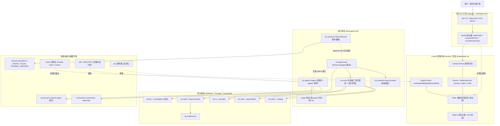
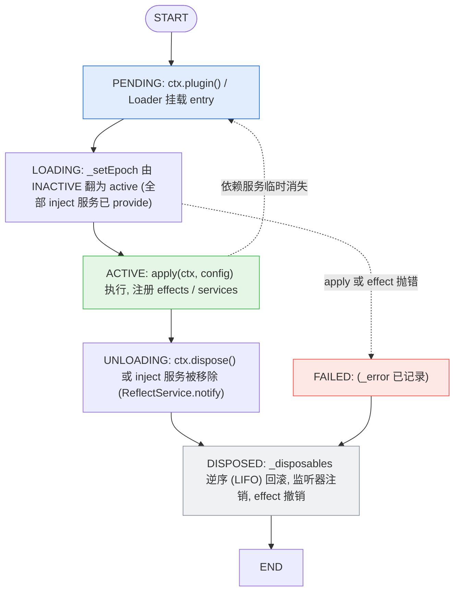
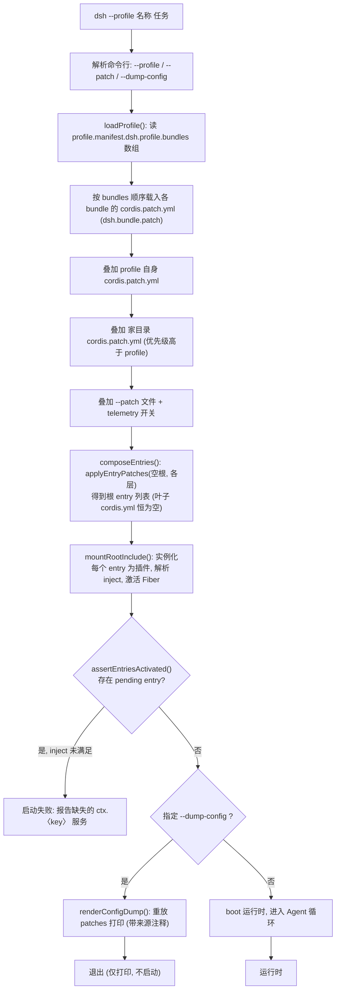
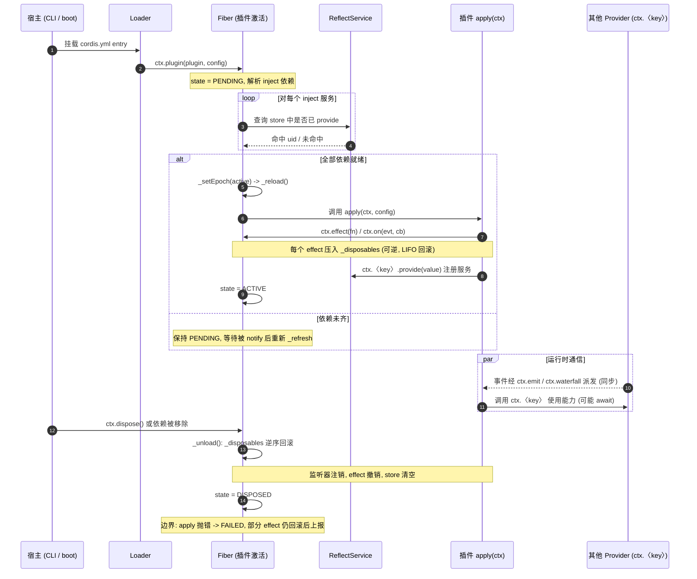
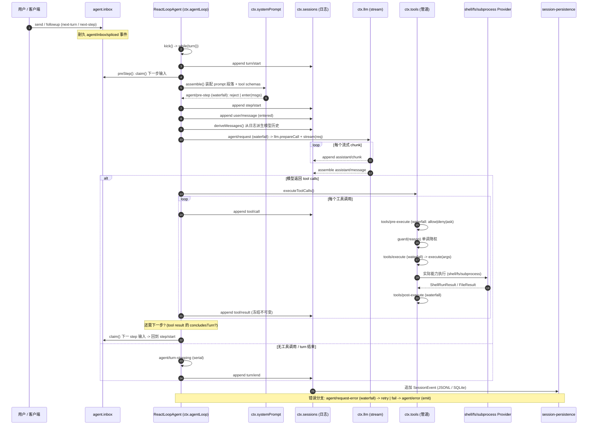
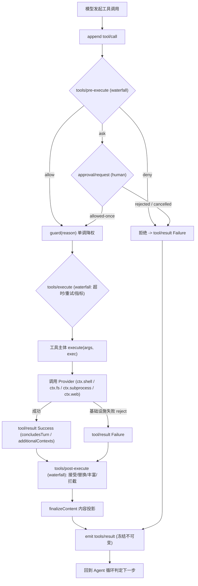
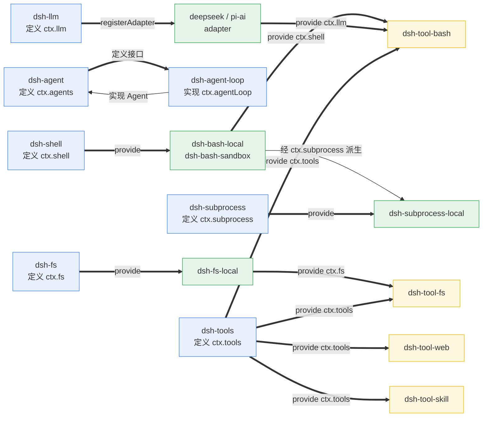
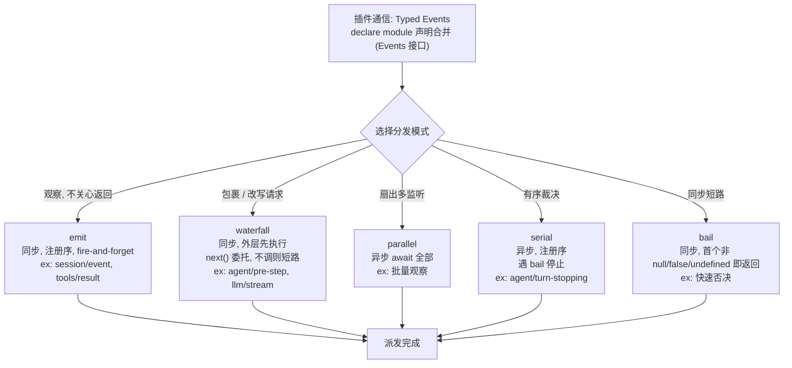

# DeepSeek Harness 技术报告：系统架构与插件机制

> 本文基于对 `deepseek-harness` 仓库源码（Cordis 框架、核心包、能力包、启动/组合层、持久化/SDK 基础设施）的深度勘察写成。所有结论均来自实际代码与仓库自带文档（`docs/architecture.md`、`docs/cordis-primer.md`、`docs/subsystems/*`、`vendor/README.md`、`packages/README.md`），并以 `文件:行号` 形式标注出处，便于你直接跳转核对。

---

## 1. 项目定位与设计哲学

DeepSeek Harness（下文简称 **dsh**）是一个**基于插件（plugin）的 AI Agent 运行框架**。它的核心信条写在 `docs/architecture.md:11`：

> 框架之下没有"特权核心"——模型适配器、工具注册表、会话日志、Agent 循环本身都是插件。任何部分都可以从配置中替换。

这意味着整个产品是一棵 Cordis **插件树（plugin tree）**，由启动时的有序层（layers）组合而成。扩展 dsh 的方式不是改写核心，而是"在别的插件旁边挂载一个插件"，而所有注册（prompt 段落、工具 schema、适配器、provider、监听器）都是 **可逆的 effect**，插件卸载时自动回滚。

### 1.1 关键术语对照

| 术语              | 含义                                                  |
| --------------- | --------------------------------------------------- |
| `ctx` / Context | 服务的仓库；`ctx.tools`、`ctx.llm` 等按 key 查找服务             |
| Service         | 向 Context 声明一个稳定 `ctx.<key>` 的能力（通常是 `Service` 子类）  |
| Plugin          | 一个对象/函数，挂载后贡献 services、typed events、effects         |
| Fiber           | 一次插件激活（activation），一个插件 = 一个 Fiber                  |
| Effect          | 注册行为（`ctx.effect()` / `ctx.on()`），卸载时逆序回滚           |
| Seam（接缝）        | 可替换能力的三个角色：Service Definition + Provider + Consumer |
| SessionEvent    | 追加式（append-only）会话日志的唯一事实来源                         |

---

## 2. 仓库结构与技术栈

这是一个 **pnpm workspace 单体仓库**，约定来自 `packages/README.md:9`：

- 每个 npm 包命名为 `@deepseek-ai/dsh-<pkg>`，位于 `packages/<group>/<pkg>/`。
- **Group** 是顶层分类（core、llm、shell、fs、web、session、acp、sdk …），每个 Group 的 README 维护"包 ↔ ctx key"对照表。
- 根 `package.json` 锁定 Node `^22.19 || >=24`，`engines` 强制版本；`pnpm@11.7.0`。
- **全量 ESM**（`"type": "module"`）；构建用 `tsc -b` + `tsdown` 出 `lib/types` 与运行时 bundle。
- TypeScript 跨 `packages` 互引用使用 `.ts` 后缀（NodeNext 安全）。

### 2.1 目录分层

```
vendor/         # 源码 vendored 的 Cordis 框架 + 基础库（cosmokit/schemastery/loader/include…）
packages/        # @deepseek-ai/dsh-* 工作区，按 group 组织
  core/          # 产品 API 脊柱：session / system-prompt / tools / agent / agent-loop / scope
  llm/           # LLM 能力族：抽象服务 + 各 provider 适配器
  shell/ fs/ subprocess/ terminal/ lsp/ web/ skill/ …  # 能力接缝族
  session/ acp/ sdk/ hooks/ preset/ interaction/ settings/ credentials/ storage/  # 基础设施
  boot/ bundle/  # 启动胶水 + --profile 补丁层
apps/ cli/       # dsh 二进制入口
native/ native-macos/  # Landlock 启动器 / Swift 相机辅助（独立原生构建）
python/          # Python SDK 运行时
docs/            # 架构文档 + 生成式参考目录（freshness-gated in CI）
examples/        # 可运行 cordis.yml 叶子（agent-spine / CLI / ACP / JSON-RPC）
```

### 2.2 Vendored 框架（重要）

`vendor/README.md` 说明：Cordis、cosmokit、schemastery、loader、include、group、timer、hmr、logger-console 都被 **改名进 `@deepseek-ai` scope** 并源码 vendored，而非从 npm 安装——目的是让框架层**完全可审计、可打补丁、版本锁定**。所有包 `private: true`，随 harness 一起发布。`pnpm-workspace.yaml` 用 `overrides` + `linkWorkspacePackages` 让 semver 区间解析到本地 workspace。

---

## 3. 插件机制：Cordis 框架核心

这是理解整个系统的钥匙。Cordis 的五个核心思想（`docs/cordis-primer.md:7`）：

1. **插件是实现 Service 的对象**——可以是带 `apply(ctx)` + `inject` 的函数，或挂载进 Context 的 `Service` 子类。
2. **Context 是服务的仓库**——`ctx.tools` 等按 key 查找，而非 import 具体实现。
3. **用 `inject` 声明服务依赖**——所需服务未就绪前，插件保持等待，因此**加载顺序由依赖表达，而非手工编排**。
4. **Typed Events 通信**——通过 TS 声明合并（declaration merging）声明事件名，再以 `emit`/`waterfall`/`parallel`/`serial`/`bail` 五种模式分发。
5. **注册是可逆 effect**——`ctx.effect()` / `ctx.on()` 安装，卸载时逆序回滚。

### 3.1 Context 与服务查找

`Context` 是对内部实例的 `Proxy`（`vendor/cordis/src/context.ts:71-84`），读 `ctx.tools` 时经 `ReflectService.handler.get` 在 fiber 链上自底向上查找 `provide` 了该 key 的最近 fiber（`vendor/cordis/src/reflect.ts:136-171`）。若该服务既不存在、也不在当前 fiber 的 `inject` 集合中 → 抛 `cannot get required service "<prop>" in inactive context`。

服务注册发生在 `ReflectService.provide`（`reflect.ts:277-305`）：创建一个 `Impl`，记录拥有它的 fiber 与一个可选 `check` 谓词；dispose 时从 store 删除并 `notify` 所有依赖方重新解析。

### 3.2 插件与 Fiber 生命周期

`Fiber`（`vendor/cordis/src/fiber.ts:184-333`）是一次插件激活，状态机：`PENDING → LOADING → ACTIVE → (UNLOADING) → DISPOSED`。`ctx.plugin()`（`registry.ts:316-336`）解析 `inject`、构建 Fiber；`fiber.dispose()` 卸载。

**依赖延迟激活**是 Cordis 的精华（`fiber.ts:597-673`）：带 `inject` 的 fiber 起于 `PENDING`；其构造函数对每个依赖检查 `_checkImpl`，再 `_refresh()` 把依赖 uid 哈希成 `epoch`（任一缺失则 `INACTIVE`）。当某个 provider 的 `notify` 翻转 epoch，`_setEpoch` 触发 `_reload()` 真正运行插件回调。这就实现了"等 `ctx.tools`/`ctx.llm` 存在后再激活"。

### 3.3 Effects：为什么"可逆"

`ctx.effect(execute, label)`（`fiber.ts:418-561`）立即运行 `execute`，收集其返回（或 yield）的 disposer 进 `_disposables`；卸载时**逆序**运行（`fiber.ts:431`、`fiber.ts:676`）。`ctx.on` 把监听器注册也做成 effect（disposer = `unregister`）。所以"一个注册是可逆的"= 它的 setup 返回一个 teardown 闭包，压进 fiber 的 `DisposableList`，LIFO 回滚。

### 3.4 Typed Events 与五种分发模式

事件表面通过 `declare module './context.ts'` + `Events` 接口声明合并（`events.ts:16-33`、`events.ts:329-352`）。`DispatchMode` 实际是 **五种**（`events.ts:32`：`'emit' | 'parallel' | 'serial' | 'bail' | 'waterfall'`），公共 API 为 `ctx.emit` / `ctx.parallel` / `ctx.serial` / `ctx.bail` / `ctx.waterfall`（`events.ts:44-106`）。`dispatch`（`events.ts:165-175`）按模式分发：

| 模式          | 是否 await | 顺序       | 返回值 | 用途                                                       |
| ----------- | -------- | -------- | --- | -------------------------------------------------------- |
| `emit`      | 否        | 注册序      | 无   | 观察（如 `session/event`、`tools/result`）                     |
| `waterfall` | 否        | 注册序（外层先） | 有   | 包裹/改写（如 `llm/stream`、`agent/pre-step`）；`next()` 委托，不调则短路 |
| `parallel`  | 是        | 并行       | 无   | 扇出观察                                                     |
| `serial`    | 是        | 注册序      | 有   | 有序裁决（如 `agent/turn-stopping`），遇 `bail` 停止                |
| `bail`      | 否        | 注册序      | 无   | 同步短路：首个非 `null`/`false`/`undefined` 返回值即返回（快速否决）         |

**Waterfall 语义（`events.ts:234-243`）**&#x662F; Cordis 的"环绕中间件"：监听器收到 `(...args, next)`，调用 `next()` 把（可能被包裹的）结果委托给下一个；不调 `next()` 直接 return 即**短路**（否决内置行为）。用于 `internal/config`、`internal/update` 等。

### 3.5 配置加载：Loader + Include + `!!js`

`cordis.yml` 被 Loader 解析为 `EntryOptions[]`（`loader/src/entry.ts:9-22`：id/name/config/group/disabled/inject）。**`!!js` 插值**：一种 YAML tag（`include/src/index.ts:9-15`），在 entry 自己的 fiber context 下惰性求值（`with (ctx) { return eval(expr) }`，`loader/config/utils.ts:4-9`）。`disabled` 字段也支持 `!!js`，在每个挂载决策点重新求值（`loader/src/config/entry.ts:104-108`）。

`@deepseek-ai/cordis-plugin-include` 的 **patch 算法**（`include/src/index.ts:applyEntryPatches`）是配置可组合性的核心（详见第 4 节）。

---

## 4. 配置即代码：Profiles / Bundles / Patches 分层

一个运行中的 `dsh` 是一棵从有序层组合出的插件树。这让"同一份框架，按需拼出 web / headless"成为可能。

### 4.1 Profile 与 Bundle

- **Profile**：`$DSH_HOME/profiles/<name>` 下的目录，其 `package.json` 的 `dsh.profile` 字段列出有序 `bundles` 数组，并持有用户自己的 `cordis.patch.yml`（`packages/boot/app-boot/src/profile.ts:48-51`）。`web` / `headless` 是出厂模板。
- **Bundle**：npm 包，其 `package.json` 用 `dsh.bundle.patch` 指向自己的补丁文件（`profile.ts:42-45`；如 `packages/bundle/base/package.json:36-40`）。组合器只认这个字段，绝不读代码。

### 4.2 分层顺序（已在启动代码核实）

`profile-boot.ts:122-151` 的 `composeProfile` 严格按此顺序拼栈：

```
[ bundlePatches (按 dsh.profile.bundles 顺序) ]
  → profile.patches (该 profile 自己的 cordis.patch.yml)
  → homePatches   ($DSH_HOME/cordis.patch.yml，优先级高于 profile 层)
  → overlays      (--patch 文件 + telemetry 开关)
```

关键洞察：**叶子 `cordis.yml` 永远是空的**——整个树都是 patch。`composeEntries` 与 `renderConfigDump` 都调用同一个 `applyEntryPatches`，保证 `--dump-config` 打印的东西与真实启动**永不漂移**（`profile.ts:427-434`、`dump-config.ts:30-52`）。

查看你机器实际启动的树：

```sh
dsh --profile web --dump-config
```

### 4.3 Patch 的两种操作（`include` 算法）

1. **按 id 整行替换**：`- id: <row>  config: {...}` —— 替换整段 `config`（**不深合并**，必须重述保留字段）。
2. **插入**：`- insert: [ {id, name, config?, disabled?, inject?} ]` —— 追加新行。被插入的行会在同列表后续 patch 中被索引，因此后面的 patch 能配置它。

找不到目标 id 的 patch 仅警告、不失败（`include/index.ts:44-57`）。

### 4.4 出厂 Bundle 一览（`dsh-base`）

`packages/bundle/base/cordis.patch.yml` 是**每个 profile 的第一层**，贡献：LLM 适配器（deepseek / pi-ai / retry）、默认模型 `deepseek-v4-flash`、全套工具（`tool-bash`、`tool-fs`、`tool-skill`、`tool-jobs`、`tool-todo`、`tool-ralph`、`tool-web`、`tool-subagent*`、`tool-workflow` …）、持久化（JSONL，SQLite 查询默认关闭）、**沙箱/审批策略**（`DSH_PERMISSION_MODE` 驱动）、settings/credentials/telemetry。

- **`web`** = `dsh-base` + `dsh-web-app`（覆盖 persona、插入 webserver/api-gateway/workspace/ui 插件阵容、把 agent 平面工具移到 preset 之后）。
- **`headless`** = `dsh-base` + `dsh-headless`（挂载 `code-runtime`，插入一次性 `headless-runner`，无 HTTP/浏览器层）。

---

## 5. 核心数据平面：Session 事件溯源日志

`packages/core/session` 是整个系统的**单一事实来源**。模型看到的一切，都必须能从日志重建。

### 5.1 追加式事件日志

`SessionEventMap`（`types.ts:236-333`）是声明合并的可扩展接口；已知 40+ 种事件类型（`known-event-types.ts:19-64`）。核心类型：`turn/start`、`turn/end`、`step/start`、`step/end`、`user/message`、`assistant/chunk`、`assistant/message`、`tool/call`、`tool/result`。

`Session.append()`（`index.ts:604-655`）分配单调递增 `seq = log.length`（连续性契约），深冻结 lossless-JSON 快照，校验表面元数据，push，再触发 `session/event`（**不阻塞 I/O**）。`events` 是缓存的、冻结的不可变快照。

### 5.2 "模型可见 = 已记录"不变量

`deriveMessages()`（`index.ts:726-747`）只遍历 `surface.nodes`（有序 seq 列表），把 `user/message` / `assistant/message` / `tool/result` 折叠成 `Message[]`。**chunk、boundary、request/header 等非 surface 事件不入模型历史**（`surface.ts:83-114`）。

> 运行时不变量强制：循环**只**从日志派生请求消息（`agent.ts:341`）；`invariant.ts` 断言 `tool/result` 必在同类 step 内跟随 `tool/call`。任何"模型可见但无法从日志重建"的输入，都必须新增一个 `SessionEvent`。

### 5.3 Fork / Resume

`SessionStore.fork`（`index.ts:1081-1153`）：`_forkSeed` 切出 `events[0..boundary]`；拒绝落在"打开的 turn"内的边界（`OPEN_TURN`）。种子通过**同一个** `append` 校验器重放，保证一致性。`Session.fromRestore`（`index.ts:495`）接管持久化图。

---

## 6. 请求生命周期：Agent / Turn / Step

驱动循环在 `packages/core/agent-loop`，实现核心包声明的 `Agent` 接口（`ctx.agentLoop`）。**扩展插件依赖 `agent`（含 `ctx.agents`），绝不依赖 `agent-loop`**——保证循环可替换（`docs/subsystems/core.md:20`）。

### 6.1 一次 Turn 的流转（`docs/architecture.md:63`）

```
turn/start
  claim 下一步输入 + 一条排队消息
  assemble prompt 段落 + tool schemas
  → agent/pre-step        reject | enter(messages)
  step/start
  append entered messages as user/message
  derive model history from log
  agent/request → llm/stream → assistant/chunk* → assistant/message
  tool/call* → tools/pre-execute → tools/execute → tools/post-execute → tool/result*
  step/end
  owe another request? → claim → next step
  → agent/turn-stopping
turn/end
```

### 6.2 核心接口（`Agent`）

`Agent`（`runtime-types.ts:64-144`）暴露：`id`、`options`(provider/model/maxTokens)、`session`、`inbox`、`status`、`ctx`、`cancel`、`whenIdle`、`runMaintenance`、`send`、`followup`、`steer`、`inject`。

- **inbox**：两条有序待处理消息列表（`next-turn` / `next-step`）。所有插入/替换/删除都是**耐久的** `agent/inbox/spliced` 事件（`inbox.ts:186`）。
- **`inject(msg)`**（`agent.ts:130`）= `send(msg,'next-step',false)` —— 排队上下文但不唤醒；驱动在下一个 step 边界 claim 它。这正是"注入模型可见上下文"的官方通道。

### 6.3 拦截点（`agent/*` 事件）

| 事件                                                  | 模式        | 作用                                            |
| --------------------------------------------------- | --------- | --------------------------------------------- |
| `agent/pre-step`                                    | waterfall | 决定模型这一步看到什么；可 `reject`（turn 空关）或 `enter` 改写消息 |
| `agent/request`                                     | waterfall | 替换冻结的调用配置（provider/model/reasoning/sampling）  |
| `agent/request-error`                               | waterfall | 模型请求失败后恢复；返回 `{kind:'retry'}` 可重试             |
| `agent/turn-stopping`                               | serial    | turn 将关时；监听者可 `steer()` 再开一步；**无 `next()`**   |
| `agent/created` / `agent/disposed` / `agent/status` | emit      | 生命周期通知（scope-filtered）                        |

`agent/pre-step` 是请求派生前唯一的串行监听链（`docs/subsystems/core.md:235`）。`agent/turn-stopping` 是数据驱动的：工具结果带 `concludesTurn` 即在 step 内结束 turn（`tools.md` `ToolExecutionSuccess.concludesTurn`）。

### 6.4 每 Agent 作用域（`scope`）

`createScope(ctx, key, {parent})`（`scope/index.ts:137-147`）基于 dsh-scope 库，把注册可见性**和** effect 归属绑定到调用 context 的 scope。`ReactLoopAgent` 构造时：`this.scope = createScope(loopCtx, this); this.ctx = this.scope.ctx.extend({ agent: this })`（`agent.ts:94-95`）。

> 因此任何经 `agent.ctx` 的 `ctx.tools.register` / `ctx.systemPrompt.section` / `ctx.tools.restrict`，都**仅对该 Agent 局部可见**，在该 agent 的 scope 卸载时一起回滚（`scope/index.ts:509`）。这就是"工具/提示段/守卫成为 agent 私有"的机制——同时仍向下继承全局注册。

---

## 7. 能力接缝模式（Capability Seam）

这是 dsh 最强大的架构模式（`docs/architecture.md:100`）：一个可替换能力有**三个角色**——

- **Service Definition**：声明接口（`ctx.<key>`）
- **Service Provider**：实现它（注册到 `ctx.<key>`）
- **Consumer**：使用它（通常是面向模型的工具）

一个包可兼任多角色，但"只有一个角色"不构成接缝。**新增能力 = 三者都要设计**。

### 7.1 范例：Bash 接缝（`packages/shell`）

| 角色             | 包                                     | 贡献                                                             |
| -------------- | ------------------------------------- | -------------------------------------------------------------- |
| **Definition** | `dsh-shell`                           | `ctx.shell`——抽象 `ShellExecutor`（resolve/run/start/sandboxMode） |
| **Provider**   | `dsh-bash-local` / `dsh-bash-sandbox` | 本地进程树 / 沙箱后端，子类化 `ShellExecutor` 并 `provide`                   |
| **Consumer**   | `dsh-tool-bash`                       | 面向模型的 `bash` 工具，调用 `ctx.shell.resolve()` 后 `run()`/`start()`   |

`ShellExecutor` 契约（`shell/src/index.ts:65`）：`resolve(request)` 把可选字段补全为 `ShellExecSpec`；`run(spec)` 前台执行（非零退出/超时/abort 都 resolve 为 `ShellRunResult`，**只有基础设施失败才 reject**）；`start(spec)` 返回无 id 的后台句柄。

### 7.2 接缝为何强大：一处替换，全局生效

关键设计（架构文档 `Seams are why one provider swap changes the whole product`）：**文件系统与子进程 provider 共享同一执行世界**。shell 的本地实现通过 `ctx.subprocess` 派生进程（`shell.md:242`）；把 shell/fs 指向远程沙箱，Bash、PTY、LSP 随之整体迁移，**无需任何 provider fork**。这正是 dsh 把"执行环境"抽象成一个接缝的价值。

### 7.3 范例：LLM 适配接缝（`packages/llm`）

`ctx.llm` 是抽象 `LlmRuntime`（`llm/src/index.ts:284`）。Adapter 契约是抽象类 `LlmAdapter`（`llm-streaming.md:689`）：子类实现 `stream(options): AsyncIterable<StreamChunk>`，再通过 `ctx.llm.registerAdapter(providers, adapter)` 注册。`GenerateOptions.provider` 选路由，`model` 交给适配器（无需生命周期早期注册）。

**流式协议 `StreamChunk`** 是闭合可辨识联合（`llm-streaming.md:192`）：`block-start` / `text-delta` / `reasoning-delta` / `tool-call-delta` / `block-end` / `usage` / `finish`。`BlockAssembler`（`assembler.ts`）是唯一共享折叠实现，边记录 raw chunk 边组装 `ContentBlock[]`，保证回放保真。

Adapter 必须守的硬约束（节选）：`usage` 在 `finish` 前；tool-call `arguments` 端到端保持 raw JSON 字符串；上下文溢出统一上报 `CONTEXT_WINDOW_EXCEEDED`；空完成是可重试错误（`EMPTY_RESPONSE`）；每个 HTTP 请求带 `attributionHeaders()`。这些让"新增模型供应商"只需写一个 `LlmAdapter` 子类，其余全不动。

---

## 8. 工具注册与受保护执行管道

`ctx.tools`（`packages/core/tools`）是作用域化的工具注册表 + 受保护执行管道。模型看到的 `ToolSchema` 与执行用的 `ToolDefinition` 分离：前者是 wire 类型（名/描述/JSON-Schema 参数），后者还含 `execute`、`output` 投影、`presentCall`/`presentResult` UI 回调（`tools.md:27`）。

### 8.1 注册与可见性

- `register(definition)`（`index.ts:1037`）：作用域工具遮蔽全局；保留名 `run_code` 被拒。
- `restrict({allow,deny})`（`index.ts:1071`）：**仅作用域**，与全局层取交集（`view()`）。
- `guard(g)`（`index.ts:1110`）：`pre-execute` 之后的单调拒绝（返回 reason 只能降权，不能放行）。

`defineTool({ name, description, parameters, output, execute })` 是 DSL：校验入参、推断 `execute` 返回类型，把执行与投影类型绑定（`schema.ts`）。

### 8.2 执行管道（waterfalls）

`execute()`（`index.ts:1342`）把一次调用穿过：

```
tools/pre-execute  (waterfall: allow | deny | ask)   ← 可改/拒/请求人类审批
→ guard(reason)      (单调降权)
→ tools/execute      (waterfall: 超时/重试/指标 包裹)
→ 工具主体 execute(args, exec)
→ tools/post-execute (waterfall: 接受/替换/丰富/拦截)
→ finalizeContent    (最后内容投影)
→ tools/result       (emit: 冻结的不可变结果)
```

- `Code Mode` 通过传输子分派把原生工具调用收敛（`tool.parent` token 标记），无 parent 的模型直呼在策略前即被拒为 `UNKNOWN_TOOL`（`tools.md:191-205`）。
- `ToolExecutionResult = Success | Failure`；`concludesTurn`/`additionalContexts` 可驱动下一步或结束 turn。

### 8.3 Prompt 装配

`ctx.systemPrompt`（`system-prompt/index.ts:338`）按 `order` 合并全局 + 作用域链的 `PromptLayer`（`-100` harness 身份、`0` persona）。`assemble()` 经 `system-prompt/assemble` waterfall，收集各 provider 的 `ToolSchema[]`，插值 `{{var}}`。工具 schema 通过 `tools()` provider 进入 `PromptAssembly.tools`（`index.ts:430`）。

---

## 9. 基础设施：持久化 / Hooks / SDK / ACP / Preset

### 9.1 会话持久化（`packages/session`）

事件溯源接缝：`ctx.sessionPersistence` 把 `SessionEvent` 作为唯一事实来源（无独立"持久化消息"类型）。两种后端共 `PersistenceCoordinator`：

- **JSONL**（`session-persistence-jsonl`）：每会话一个 `.jsonl.zstd`（`session-persistence-jsonl/README.md:9`）。
- **SQLite**（`session-persistence-sqlite`）：每个 `SessionEvent` 1:1 映射到 `(session_id, seq, type, time, data, source_event_seqs, surface_op)`（`schema.ts:23`）。`SCHEMA_VERSION = 15`（`schema.ts:15`），**只在表结构破坏性变更时 bump**；打开时拒绝非当前版本而非迁移（`schema.ts:108-110`）。

崩溃的最终 turn 在 `load` 时以合成 `tool/result`/`step/end`/`turn/end {interrupted}` 闭合（不截断）。

**投影接缝**（`session-projection`）：`ctx.sessionProjections` 注册纯函数 `ProjectionDefinition{key, schema, init, apply, view, stateVersion}`；框架订阅一次 `session/event` 即贪心折叠所有单元（"同引用即无操作"门控）。**日志驱动标题**（`session-title`）：每次接受修订都是 log-only 的 `session/title` 事件。

### 9.2 Hooks（`packages/hooks`）

`hook-protocol` 是线协议词汇表；Claude Code / Codex 桥接把它映射到 harness 拦截点：

- **退出码语义**（`codec.ts:59-89`）：`0` 可带结构化 JSON；`2` 阻塞（stderr 为理由）；其他退出为非阻塞错误。
- **Claude Code 桥接**：观察 `SessionStart`、`UserPromptSubmit→agent/pre-step`、`PreToolUse→tools/pre-execute`、`PostToolUse→tools/post-execute`、`Stop→agent/turn-stopping`（`hooks-claude-code/src/index.ts:206-295`）。
- **Codex 桥接**：仅正则匹配、snake_case、无预工具 ask（`hooks-codex/src/index.ts:224-231`）。

### 9.3 进程外 SDK / JSON-RPC（`packages/sdk`）

`protocol` 定义线类型（`initialize` / `session/prompt` / `shutdown` + 4 个通知：`session.event`/`session.status`/`subagent.started`/`subagent.finished`）。`JsonRpcLineTransport` 是换行分隔的 JSON-RPC 2.0（`transport.ts`）。`HarnessClient` 派生运行时子进程，经 EOF→SIGTERM→SIGKILL 阶梯回收（`client.ts:203-261`）。**为何进程外**：运行时独立进程拥有运行时，SDK 只提供可执行文件 + `cordis.yml`，与 Python `HarnessClient` 共用同一协议（`sdk/README.md:5`）——语言无关、隔离可控。

### 9.4 ACP（`packages/acp`）

`Agent Client Protocol` 服务器，**仅自动化用途**（非展示层）。用 `@agentclientprotocol/sdk` 的 `AgentSideConnection` 经 stdio JSON-RPC（`acp/src/index.ts:43-48`）。只发出已提交的 `assistant/message`（丢弃 raw chunk/reasoning/tool/plan/title）；权限请求仅 `allow-once`/`reject-once`，**绝不推断持久授权**（`index.ts:271-285`）。与 web host 的区别：不含人机交互/展示特性。

### 9.5 Preset（`packages/preset`）

per-session 的 agent 组合来自预设 `agent.cordis.yml` 文件（`preset/README.md:5`）。`mountPreset(agentCtx, preset)` 把子树挂在 agent 的 scope context 下，其 `ctx.tools`/`ctx.systemPrompt` 注册随之随该 agent 卸载（`mount.ts:332-381`）。**`isolate` realm**：预设可在隔离 realm 后发布服务，使两 session 不冲突（`mount.ts:178-203`）；`leakedServices()` 报告泄漏进 ROOT realm 的实现。所选预设记录为 log-only 的 `agent-preset/selected`，resume/fork 时按 newest-wins 重建同一组合（`session.ts:48-54`）。

### 9.6 人机协作平面（`packages/interaction`）

- `ctx.commands`：人类命令注册/分发。
- `ctx.approval`：`ApprovalService` 在 answerer 前应用策略；结果 `allowed-once | rejected | cancelled | unavailable`（fail-closed）；`approval/request` 是 agent 作用域 waterfall（`user-approval/src/index.ts:192`）。
- `ctx.permissionPresets`：把沙箱模式 + 审批策略打包成具名预设（`workspace-write`+ask、`danger-full-access`+never）。
- `ask_user_question` 工具（`tool-ask-user`）：暂停循环直到 UI provider 返回答案，作为普通 tool result 回灌。

---

## 10. 设计原则速查（写给扩展者）

### 10.1 两个贯穿全仓库的类型模式（`docs/subsystems/core.md:256`）

1. **`…Map → derived-union`**：几乎所有可扩展联合类型都用一个按判别标签 keyed 的接口，插件通过 `declare module` 添加变体，无需改源码包。六大核心 map：`ContentBlockMap`、`MessageSourceMap`、`FinishReasonMap`、`TurnTriggerMap`、`TurnEndReasonMap`、`SessionEventMap`。**`switch` 在 tag 上**——拼错 tag 编译即失败。
2. **Branded IDs**：包间传递的 ID 是品牌化字符串（`Branded<B>`，`util/brand`），`SessionId` 不能当 `CallId` 用——结构上是字符串，类型层不互通。

### 10.2 扩展点对照表（去哪加行为）

| 目标               | 机制                                                      |
| ---------------- | ------------------------------------------------------- |
| 加模型供应商           | 在 `ctx.llm` 注册 `LlmAdapter`                             |
| 加模型可见能力          | 注册到 `ctx.tools`（schema 自动进 prompt 装配）                   |
| 给某 session 不同能力集 | 组合 agent preset（service 行需 `isolate` realm）             |
| 加 shell 执行       | 注册 `ctx.shell` 后端（本地经 `ctx.subprocess` 派生）              |
| 加持久终端            | 注册 `ctx.terminals` + `dsh-tool-terminal`                |
| 加人类命令            | 注册到 `ctx.commands`（不走模型 turn）                           |
| 加后台工作            | 注册到 `ctx.jobs`（`job_*` 工具收集/停止）                         |
| 加文件系统/策略         | 注册 `ctx.fs` provider 或监听 `fs/*`                         |
| 限制派生进程           | 用 `ctx.sandbox` 后端（consumer 在 spawn 前包裹 argv）           |
| 拦截请求/工具/turn     | 用 `agent/*` / `tools/*` 事件；`agent/turn-stopping` 停 turn |
| 加模型可见上下文         | `agent.inject()`（落到下次被接纳的请求）                            |
| 加耐久会话状态          | 扩展 `SessionEventMap`，从日志渲染+重放                           |
| Fork 活跃 session  | `ctx.sessions.fork(source, boundary?, childSessionId?)` |
| 把注册限定到单个 agent   | 用该 agent 的 `agent.ctx`                                  |

### 10.3 框架级契约

- **没有特权核心**：任何行为都是插件，可配置替换。
- **注册即 effect**：卸载逆序回滚；依赖用 `inject` 表达，避免手工编排启动序。
- **模型可见 = 已记录**：任何进入模型请求的事实都必须能从 `SessionEvent` 日志重建（运行时断言强制）。
- **接缝三件套**：新增能力要同时设计 Definition / Provider / Consumer。
- **适配器硬契约**：LLM 适配器守流式/错误/重放/归因等规则，消费者可依赖。

---

## 11. 构建、质量门禁与工具

根 `package.json` 暴露完整工具链（`scripts`）：

- **构建**：`build:lib:host`（tsc -b + tsdown host）/ `build:lib:client`（client）/ `build:web`（VitePress/前端）。
- **测试**：`test`（vitest）/ `test:coverage`（**CI 覆盖率门槛：packages/*/*/src 逐文件 100%**，`doc-sync` 注释明确）/ `test:e2e`（需 `DEEPSEEK_API_KEY` 自跳过）/ `test:snapshot`（无 key 重放预期输出）。
- **质量门禁 `hygiene`**：`rescope-vendor:check && knip && publint && constraints && verify-dsh-package-licenses && verify-package-invariants && …` 一长串校验，确保无死代码、发布合规、包不变量、Cordis 配置、NodeNext 类型、可选依赖、运行时闭包、vendored 链接都正确。
- **文档门禁 `doc-sync`**：`verify-doc-budgets`（词数上限）、`verify-md-links`、`verify-cordis-catalog`/`verify-cordis-api`（生成目录新鲜度）、`verify-type-equiv`（文档内 TS 片段可编译）、`verify-package-readmes`（每个包必须有 Model Experience / Known Limitations）。
- **生成器**：`gen-cordis-catalog` / `gen-cordis-api` / `gen-tool-catalog` / `gen-module-graph` / `gen-doc-graphs` / `gen-persistence-catalog` —— 所有参考目录由源码生成、CI 新鲜度-gated，禁止手改。
- **`rescope-vendor`**：同步上游 Cordis 后重命名回 `@deepseek-ai` scope。

### 11.1 仓库纪律（值得借鉴）

- 文档分层（Root AGENTS.md ↔ 子树 AGENTS.md ↔ architecture.md ↔ subsystems ↔ Agent Notes ↔ cookbook），**每个事实只有一处家**（one home per fact），其余链接。
- **文档写当前状态，不写历史**：禁用 "previously/now/no longer"、PR/commit 叙述；变更故事进 Agent Notes / postmortem。
- **Agent Note 是决策记录**：为什么、放弃了什么、需要验证什么；`implemented/` 笔记描述已交付现实（现在时）。

---

## 12. 一句话总结

DeepSeek Harness 把"一个 AI Agent 产品"拆解成一棵 **Cordis 插件树**：vendored 框架提供 `Context/Service/Fiber/Event/Effect` 原语；`dsh --profile` 用 **bundle + patch 分层**拼出 web / headless；核心包以**事件溯源的 Session 日志**为唯一事实来源，驱动**可替换的 Agent 循环**；能力通过**接缝三件套（Definition/Provider/Consumer）**&#x5B9E;现，使"换一个 provider 即换整片产品"；工具经**受保护 waterfall 管道**执行；持久化、Hooks、进程外 SDK、ACP、Preset 把数据平面与协作平面补全。扩展几乎永远发生在**已声明的扩展点**（事件 / scope / ctx-key）上，而非修改核心。

---

*报告基于 deepseek-harness 当前源码（commit 区间见 `vendor/README.md`），所有 `文件:行号` 均指向实际代码，可用 `dsh --profile web --dump-config` 与 `pnpm run gen-*-catalog` 进一步交叉验证。*

---

## 13. 架构可视化图表（附说明）

本节用一组架构图把前文 prose 落到可视图。所有图均**经源码核实**，命名与第 1–12 章保持一致，图例统一见 [13.9](#139-图例与阅读指引)。关键事实来源：

- `FiberState` 枚举（`vendor/cordis/src/fiber.ts:147-154`）：`PENDING | LOADING | ACTIVE | FAILED | DISPOSED | UNLOADING`
- 五种事件分发模式（`vendor/cordis/src/events.ts:32`）：`emit | parallel | serial | bail | waterfall`
- `SessionEventMap`（`packages/core/session/src/types.ts:236-333`）
- `ReactLoopAgent` 驱动（`packages/core/agent-loop/src/agent.ts`）
- 分层启动（`packages/boot/app-boot/src/profile.ts`、`index.ts`）

### 13.1 系统架构总览图



**图 13.1 说明**：整张图表达的是"**产品 = 一棵 Cordis 插件树**"。自下而上分三层：

- **框架内核**（最底）：提供 `Context / Service / ReflectService / Fiber / Events / Effect` 原语。所有 `ctx.<key>` 服务都在这里被查找与提供。
- **核心脊柱**：`session`、`system-prompt`、`tools`、`agent`、`agent-loop`、`scope` 六个包，构成产品 API 脊柱。`agent-loop` 实现 `agent` 声明的接口（虚线"实现"），扩展插件只依赖 `ctx.agents`，不依赖 `ctx.agentLoop`，从而循环可替换。
- **能力接缝**：LLM / Shell / FS / Subprocess / Web / Skills，每个都是"定义 + 实现 + 消费"三件套（详见第 7 章）。
- **基础设施/数据平面**：持久化、Hooks、进程外 SDK、ACP、Preset、人机协作。

关键数据流（蓝色粗箭头）：用户输入经宿主进入 `agentLoop`；循环通过 `ctx.llm` 拿流式响应、通过 `ctx.tools` 调度工具；工具再经 Shell/FS/Subprocess 接缝真正执行；**每一步都 append 进 `ctx.sessions` 的追加式日志**，由 `session-persistence` 落盘。这条"日志驱动循环"的链路是系统不变量（见 5.2）。

### 13.2 插件生命周期状态机



**图 13.2 说明**：一个插件 = 一个 `Fiber`（`vendor/cordis/src/fiber.ts:184-333`），其状态由 `FiberState` 枚举刻画（`fiber.ts:147-154`）。流转要点：

- **PENDING → LOADING**：由 `_setEpoch` 触发（`fiber.ts:625-639`）。当且仅当插件声明的全部 `inject` 依赖都已 `provide`，epoch 才从 `INACTIVE` 翻为 active，`_reload()` 才真正运行插件回调。这就是"依赖延迟激活"——**无需手工编排启动顺序**。
- **LOADING → ACTIVE / FAILED**：`apply(ctx, config)` 成功则进入 ACTIVE；若回调或其中某个 effect 抛错，记录 `_error` 进入 FAILED。注意 FAILED 下已注册的**部分 effect 仍会被回滚**，避免半激活泄漏。
- **ACTIVE → PENDING（循环边）**：这是 Cordis 最反直觉但最关键的特性——若某被依赖的服务被移除，`ReflectService.notify` 会让依赖方 epoch 翻回 INACTIVE、执行 `_unload` 清空 store，fiber 回落到 PENDING；依赖回来时**同一 fiber 重新 LOADING → ACTIVE**，无需重建。这支撑了"换一个 provider 即换整片产品"。
- **ACTIVE → UNLOADING → DISPOSED**：由 `ctx.dispose()` 或依赖永久消失触发，`_unload`（`fiber.ts:675-686`）把 `_disposables` **逆序**回滚，监听器注销、effect 撤销——即"注册即可逆"。

### 13.3 配置加载与 Profile/Bundle 分层流程图



**图 13.3 说明**：一个运行中的 `dsh` 是**从有序层组合出的插件树**（见第 4 章）。流程要点：

- 启动从命令行 `--profile` 出发，`loadProfile` 按 `dsh.profile.bundles` 顺序逐层取补丁（`profile.ts:401-417`）。
- 分层顺序（已在 `composeProfile` 核实）：**bundle 补丁（按序）→ profile 自身 patch → 家目录 patch → `--patch` 覆盖层**。
- 关键不变量：**叶子 `cordis.yml` 永远为空，整棵树都是 patch**。`composeEntries` 与 `renderConfigDump` 复用同一个 `applyEntryPatches`，所以 `dsh --profile web --dump-config` 打印的东西与真实启动**永不漂移**。
- **边界/错误分支**：`assertEntriesActivated`（`index.ts:692-725`）检查是否有 entry 因 `inject` 未满足而处于 pending；若有则启动失败并报告缺失的 `ctx.<key>` 服务——这正是配置写错（如漏挂某个 provider bundle）时的报错点。
- `--dump-config` 只是把同样的分层重放一遍并打印（附 `patched by …` 来源注释），然后退出，不进入运行时。

### 13.4 插件与宿主运行时序图



**图 13.4 说明**：描绘单个插件从"被宿主挂载"到"被卸载"的全过程，对应图 13.2 的状态机。重点：

- **加载（同步）**：`Loader` 调 `ctx.plugin`，fiber 解析 `inject`，逐个向 `ReflectService` 查询依赖。依赖齐 → `_reload` → 调 `apply(ctx, config)`。
- **注册即可逆**：插件内所有 `ctx.effect` / `ctx.on` 都被包成 fiber 的 effect，压入 `_disposables`；卸载时**逆序**回滚。因此插件"贡献服务/监听"与"撤销"是同一个闭包的正反面。
- **同步/异步边界**：事件派发本身（`emit`/`waterfall`/`bail`）是**同步**的；`parallel`/`serial` 是 `await` 的。`Plug` 调 `ctx.<key>` 使用其他 provider 时，若该 provider 内部有异步逻辑（如 `ctx.llm.stream`），则调用方 `await`。**注意**：waterfall 的"外层先执行"只在同步语义下成立；若某监听器 `await`，后续监听器会等它。
- **卸载**：宿主 `ctx.dispose()` 或依赖消失触发 `_unload`，逆序回滚。
- **错误分支**：`apply` 抛错进 FAILED，部分 effect 回滚后上报（对照图 13.2 的 FAILED 节点）。

### 13.5 一次 Turn/Step 的运行时序图



**图 13.5 说明**：这是系统最核心的运行时序，对应第 6 章与 `ReactLoopAgent`（`packages/core/agent-loop/src/agent.ts`）。关键点：

- **inbox 是入口**：用户/客户端 `send`/`followup` 写入 `agent.inbox`（`next-turn`/`next-step` 两条耐久队列），落为 `agent/inbox/spliced` 事件——所以"排队"本身也是持久化的。
- **每步都从日志派生**：`preStep` claim 输入 → `systemPrompt.assemble` 装配 → `agent/pre-step` waterfall 决定模型看到什么（可 `reject` 空关或 `enter` 改写）→ `deriveMessages()` **只从 `ctx.sessions` 日志派生**模型历史（不变量 5.2）。
- **流式**：`llm.stream` 是 `AsyncIterable`，每个 chunk 落 `assistant/chunk`，最后折叠成 `assistant/message`。
- **工具循环**：模型返回 tool calls → `executeToolCalls`（`tool-calls.ts`）逐条穿过 `tools/*` waterfall 管道（见 13.6）→ 经 Provider 真正执行 → 落 `tool/result`。若结果未 `concludesTurn`，循环 claim 下一步回到 `step/start`。
- **结束**：无工具调用或 `concludesTurn` 为真 → `agent/turn-stopping`（serial）→ `turn/end`。
- **错误分支**：模型请求失败走 `agent/request-error`（waterfall），返回 `{kind:'retry'}` 可重试，否则 `agent/error`（emit）。
- **同步/异步**：`send`/事件 `append` 多为同步；`llm.stream`、`tools/pre-execute` 的 human-ask、Provider 执行均为 `await`。

### 13.6 工具受保护执行管道



**图 13.6 说明**：工具执行是一条**受保护 waterfall 管道**（见第 8 章），对应 `ctx.tools.execute`（`index.ts:1342`）。要点：

- **pre-execute（waterfall）** 是调用前唯一串行监听链：可 `allow`、`deny`，或 `ask`（转人工审批）。审批走 `approval/request`（agent 作用域 waterfall），结果 `allowed-once | rejected | cancelled`，**fail-closed**——被拒即 `tool/result Failure`。
- **guard(reason)** 是 `pre-execute` 之后的单调降权：返回的 reason 只能收紧权限，不能放宽（安全边界）。
- **execute（waterfall）** 包裹超时/重试/指标，再调工具主体；工具主体经对应 Provider（shell/fs/subprocess/web）真正执行。注意：**只有基础设施失败才 `reject`**，业务级非零退出/超时/abort 都 `resolve` 为 `ShellRunResult`（见 7.1）。
- **post-execute（waterfall）** 可接受/替换/丰富/拦截结果；最后 `finalizeContent` 投影，`emit tools/result` 冻结为不可变事件。
- **边界**：`Code Mode` 下无 parent 的模型直呼在策略前即被拒为 `UNKNOWN_TOOL`（`tools.md:191-205`）；`concludesTurn` 决定 turn 是否结束。

### 13.7 插件依赖关系图



**图 13.7 说明**：用"接缝三件套"视角（`Definition ⇒ Provider ⇒ Consumer`）画出包级依赖，对应第 7 章。三种颜色节点：

- **蓝（Definition）**：声明 `ctx.<key>` 接口的包。
- **绿（Provider）**：实现接口并 `provide` 到 `ctx.<key>` 的包。
- **黄（Consumer）**：使用服务的面向模型工具包。

关键关系：

- `dsh-tool-bash` 只依赖 `ctx.shell`（黄→蓝虚线经 Provider），**不直接依赖 bash 后端**——所以换本地/沙箱后端无需改工具。
- **Shell 与 Subprocess 共享执行世界**：`dsh-bash-local` 通过 `ctx.subprocess` 派生进程（`PROV_BASH → PROV_SUB`）。这正是"把 shell/fs 指向远程沙箱时，Bash/PTY/LSP 整体迁移"的底层原因（见 7.2）。
- `dsh-agent-loop` **实现** `dsh-agent` 声明的 `Agent` 接口（`DEF_LOOP → DEF_AGENTS` 反向箭头），而消费者（工具、preset）只依赖 `ctx.agents`——保证循环可替换。

### 13.8 事件通信机制图



**图 13.8 说明**：插件间通信的统一原语是 **Typed Events**（五种模式，见 3.4）。选路逻辑：

- **emit**：纯观察，同步、`fire-and-forget`（如 `session/event`、`tools/result`）。
- **waterfall**：包裹/改写型，同步、外层先执行；监听器拿到 `(...args, next)`，调 `next()` 把（可能被包裹的）结果委托给下一个，**不调 `next()` 直接 return 即短路**——这是"否决内置行为"的机制（如 `agent/pre-step` 可 `reject`、`llm/stream` 可改写请求）。
- **parallel**：异步 `await` 所有监听，用于扇出观察。
- **serial**：异步、注册序，遇 `bail` 停止，用于有序裁决（如 `agent/turn-stopping` 让监听者 `steer()` 再开一步）。
- **bail**：同步短路，首个非 `null`/`false`/`undefined` 返回值即返回，用于快速否决。

> 同步/异步边界提醒：只有 `parallel`/`serial` 会 `await`；`emit`/`waterfall`/`bail` 是同步派发。插件在 waterfall 监听器里 `await` 时，后续监听器会等它完成——这是图 13.4 标注的"同步语义仅在无 await 时成立"的来源。

### 13.9 图例与阅读指引

| 图                 | 回答的问题                              | 对应章节        |
| ----------------- | ---------------------------------- | ----------- |
| 13.1 架构总览         | 整体由哪些层/模块组成，数据怎么流                  | 第 1–2、12 章  |
| 13.2 生命周期状态机      | 插件从挂到卸经历哪些状态、触发条件                  | 第 3.2–3.3 章 |
| 13.3 配置分层流程       | `dsh --profile` 如何拼出插件树            | 第 4 章       |
| 13.4 插件↔宿主时序      | 插件与框架如何交互、同步/异步在哪                  | 第 3 章       |
| 13.5 Turn/Step 时序 | 一次请求在循环里怎么走                        | 第 5–6 章     |
| 13.6 工具管道         | 工具调用如何被保护地执行                       | 第 8 章       |
| 13.7 依赖关系         | 包级 Definition/Provider/Consumer 依赖 | 第 7 章       |
| 13.8 通信机制         | 插件用什么模式互发事件                        | 第 3.4 章     |

**统一术语**（全图一致）：

- `ctx.<key>`：服务键，如 `ctx.sessions` / `ctx.systemPrompt` / `ctx.tools` / `ctx.agents` / `ctx.agentLoop` / `ctx.llm` / `ctx.shell` / `ctx.fs` / `ctx.subprocess` / `ctx.web` / `ctx.skills` / `ctx.credentials` / `ctx.settings`。
- `FiberState`：`PENDING | LOADING | ACTIVE | FAILED | DISPOSED | UNLOADING`。
- 事件分发：`emit | waterfall | parallel | serial | bail`。
- 关键事件：`turn/start` `step/start` `user/message` `assistant/chunk` `assistant/message` `tool/call` `tool/result` `turn/end`（SessionEvent）；`agent/pre-step` `agent/request` `agent/request-error` `agent/turn-stopping`（agent 拦截点）；`tools/pre-execute` `tools/execute` `tools/post-execute` `tools/result`（工具管道）。
- 核心不变量：**模型可见 = 已记录**（任何进入模型的事实都必须能从 `SessionEvent` 日志重建）。

> 所有 Mermaid 图在 GitHub / VitePress（本项目 `website/` 即 VitePress）中可直接渲染；如需离线查看，可用 `mmdc -i TECHNICAL_REPORT_zh.md -o report.svg` 或任意 Mermaid Live Editor 导出。

---

*架构图均依据 deepseek-harness 当前源码核实（见各图标注的 `文件:行号`），与第 1–12 章 prose 互文，术语与命名保持一致。*
